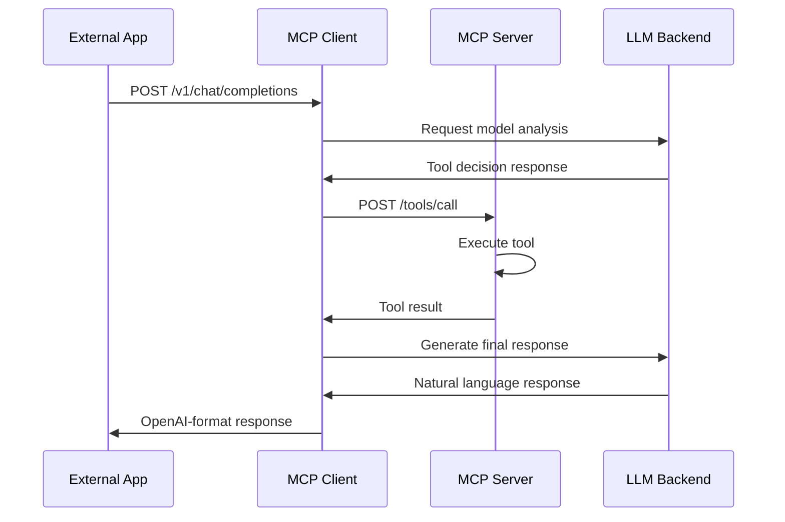

# MCP Host CES2026 - Separated Architecture Documentation

## Overview

This document describes the separated server-client architecture of MCP Host CES2026, detailing the architectural decisions, component interactions, and deployment strategies.

## Architecture Philosophy

The project follows a **microservices-inspired separation** where:

1. **MCP Server**: Pure tool provider focused on MCP protocol implementation
2. **MCP Client**: API gateway providing OpenAI-compatible interface
3. **HTTP Communication**: RESTful JSON communication between components
4. **Shared Utilities**: Common configuration and type definitions

## Component Architecture

### 1. MCP Server (Port 8081)

**Purpose**: Tool execution and MCP protocol handling

**Responsibilities**:
- MCP tool registration and management
- JSON-RPC 2.0 protocol implementation
- Tool execution (weather, time, LLM chat, test tools)
- Resource and prompt management
- Input validation and security

**Key Files**:
- `mcp_server/main.go` - Entry point and server initialization
- `mcp_server/server.go` - MCP protocol handler
- `mcp_server/config.json` - Server-specific configuration

**Endpoints**:
- `GET /health` - Health check
- `POST /tools/list` - List available tools
- `POST /tools/call` - Execute specific tool
- `POST /mcp` - JSON-RPC MCP protocol endpoint

### 2. MCP Client (Port 8080)

**Purpose**: OpenAI-compatible API gateway and request routing

**Responsibilities**:
- OpenAI-compatible API implementation
- Request routing to MCP Server
- LLM provider management
- Model discovery and validation
- Response formatting

**Key Files**:
- `mcp_client/main.go` - Entry point and client initialization
- `mcp_client/http_server.go` - OpenAI-compatible API server
- `mcp_client/config.json` - Client-specific configuration

**Endpoints**:
- `GET /health` - Health check
- `GET /v1/models` - List available models
- `POST /v1/completions` - Text completion with tool integration
- `POST /v1/chat/completions` - Chat completion with tool calling

### 3. Shared Utils Package

**Purpose**: Common functionality and configuration management

**Responsibilities**:
- Configuration loading and validation
- Shared type definitions
- Utility functions
- Error handling patterns

**Key Files**:
- `utils/config.go` - Configuration management
- `utils/types.go` - Shared type definitions
- `utils/go.mod` - Shared dependencies

## Communication Flow

### Standard Tool Calling Flow



### HTTP Communication Protocol

**Request Format** (Client → Server):
```json
{
  "method": "POST",
  "url": "http://localhost:8081/tools/call",
  "headers": {
    "Content-Type": "application/json"
  },
  "body": {
    "tool_name": "get_weather",
    "arguments": {
      "location": "Tokyo",
      "units": "celsius"
    }
  }
}
```

**Response Format** (Server → Client):
```json
{
  "success": true,
  "result": {
    "type": "text",
    "content": "Weather data in JSON format..."
  },
  "execution_time": "234ms"
}
```

## Deployment Architecture

### Local Development

```
┌─────────────────┐    ┌─────────────────┐
│   MCP Client    │    │   MCP Server    │
│   Port 8080     │◄──►│   Port 8081     │
│                 │    │                 │
│ Terminal 1      │    │ Terminal 2      │
└─────────────────┘    └─────────────────┘
         │                       │
         ▼                       ▼
┌─────────────────┐    ┌─────────────────┐
│   LLM Backend   │    │   External APIs │
│   Port 1234     │    │ WeatherAPI.com  │
└─────────────────┘    └─────────────────┘
```

### Production Deployment

```
┌─────────────────┐    ┌─────────────────┐
│   Load Balancer │    │   MCP Client    │
│   Port 80/443   │◄──►│   Port 8080     │
│                 │    │   (Multiple)    │
└─────────────────┘    └─────────────────┘
                                │
                                ▼
                       ┌─────────────────┐
                       │   MCP Server    │
                       │   Port 8081     │
                       │   (Multiple)    │
                       └─────────────────┘
```

### Multi-Platform Release

The build system supports:
- **linux/amd64** - Standard Linux servers
- **linux/arm64** - ARM-based servers (AWS Graviton, etc.)
- **darwin/arm64** - Apple Silicon development machines

Each release package includes:
- Compiled binaries for both server and client
- Configuration files
- Startup scripts
- Documentation
- Test scripts

## Configuration Management

### Separated Configuration Strategy

**Server Configuration** (`mcp_server/config.json`):
```json
{
  "server": {
    "name": "MCP Server",
    "version": "1.0.0"
  },
  "weatherapi": {
    "api_key": "your_key_here"
  },
  "http_server": {
    "port": 8081,
    "host": "0.0.0.0"
  }
}
```

**Client Configuration** (`mcp_client/config.json`):
```json
{
  "server": {
    "name": "MCP Client",
    "version": "1.0.0"
  },
  "llm_providers": [
    {
      "name": "lmstudio",
      "type": "lmstudio",
      "base_url": "http://localhost:1234",
      "enabled": true
    }
  ],
  "mcp_servers": [
    {
      "name": "local_server",
      "url": "http://localhost:8081",
      "enabled": true
    }
  ],
  "http_server": {
    "port": 8080,
    "host": "0.0.0.0"
  }
}
```

## Build System Architecture

### Multi-Platform Build Process

The `build/Makefile` supports:

1. **Individual Component Builds**:
   ```bash
   make server  # Build MCP Server for all platforms
   make client  # Build MCP Client for all platforms
   ```

2. **Complete Build**:
   ```bash
   make all     # Build both components for all platforms
   ```

3. **Release Packaging**:
   ```bash
   make release # Create platform-specific release packages
   ```

### Release Package Structure

Each platform release includes:
```
mcphost_ces2026_linux_amd64_v20250816/
├── mcp_server              # Server binary
├── mcp_client              # Client binary
├── mcp_server_config.json  # Server configuration
├── mcp_client_config.json  # Client configuration
├── start_server.sh         # Server startup script
├── start_client.sh         # Client startup script
├── PLATFORM_README.md      # Platform-specific instructions
├── README.md               # General documentation
└── test_script/            # Test scripts
```

## Testing Architecture

### Test Strategy

1. **Unit Testing**: Individual component functionality
2. **Integration Testing**: Server-client communication
3. **System Testing**: End-to-end workflow validation
4. **Performance Testing**: Load and response time validation

### Test Scripts

**HTTP Communication Testing** (`test_script/test_http_communication.sh`):
- Tests server-client connectivity
- Validates API endpoints
- Checks error handling
- Measures response times

**Tool Calling Testing** (`test_script/test_tool_calling.sh`):
- Tests complete tool calling workflow
- Validates model integration
- Checks security features
- Performance benchmarking

**Multi-Model Testing** (`test_script/test_models.sh`):
- Tests multiple LLM models
- Generates performance reports
- Comparative analysis

## Security Architecture

### Input Validation

**Server-Side Validation**:
- SQL injection protection
- XSS attack prevention
- Path traversal blocking
- Command injection prevention
- Unicode attack detection

**Client-Side Validation**:
- Request sanitization
- Model validation
- API key protection
- Rate limiting

### Network Security

- HTTP-only communication (HTTPS in production)
- Localhost binding for internal communication
- External access only through client
- No direct server exposure

## Performance Characteristics

### Response Time Targets

- Health checks: < 50ms
- Tool list requests: < 100ms
- Simple tool calls: < 500ms
- Complex tool chains: < 2000ms

### Scalability Considerations

**Horizontal Scaling**:
- Multiple client instances behind load balancer
- Multiple server instances for tool execution
- Database connection pooling (future)

**Vertical Scaling**:
- Increased memory for model caching
- CPU scaling for concurrent requests
- Storage scaling for logging

## Error Handling Strategy

### Error Categories

1. **Network Errors**: Connection failures, timeouts
2. **Validation Errors**: Invalid input, missing parameters
3. **Tool Errors**: External API failures, resource unavailable
4. **System Errors**: Memory, disk, configuration issues

### Error Response Format

```json
{
  "success": false,
  "error": {
    "code": "TOOL_EXECUTION_FAILED",
    "message": "Weather API returned error 403",
    "details": {
      "tool_name": "get_weather",
      "api_response": "Invalid API key",
      "timestamp": "2025-08-16T12:00:00Z"
    }
  }
}
```

## Future Enhancements

### Planned Features

1. **Authentication System**: JWT-based auth for production
2. **Database Integration**: Persistent storage for configurations and logs
3. **Monitoring**: Prometheus metrics and Grafana dashboards
4. **Container Support**: Docker and Kubernetes deployment
5. **Load Balancing**: Built-in client-side load balancing

### Architecture Evolution

1. **Message Queue Integration**: Redis/RabbitMQ for async processing
2. **Microservices Expansion**: Additional specialized services
3. **API Gateway**: Dedicated gateway with routing and authentication
4. **Service Mesh**: Istio integration for advanced networking

## Troubleshooting Guide

### Common Issues

**Services Won't Start**:
- Check port availability (8080, 8081)
- Verify configuration files exist
- Check Go module dependencies

**Communication Failures**:
- Verify both services are running
- Check firewall settings
- Test with curl commands

**Tool Execution Failures**:
- Verify LLM backend connectivity
- Check API keys in configuration
- Review server logs for errors

### Debug Commands

```bash
# Check service status
curl http://localhost:8080/health
curl http://localhost:8081/health

# Test communication
./test_script/test_http_communication.sh

# Debug tool calling
./test_script/test_tool_calling.sh

# Interactive debugging
./mcp_client/mcp_client -interactive
```

## Conclusion

The separated architecture provides:

- **Independence**: Components can be developed, deployed, and scaled independently
- **Flexibility**: Easy integration with different external systems
- **Reliability**: Failure isolation between components
- **Maintainability**: Clear separation of concerns
- **Scalability**: Horizontal scaling capabilities

This architecture successfully transforms a monolithic MCP implementation into a distributed, production-ready system suitable for enterprise deployment.