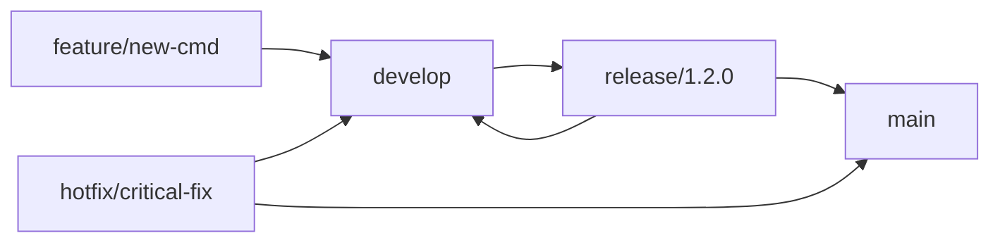

# RTK MQTT 版本發布指南

## 概述

本指南涵蓋 RTK MQTT 系統的完整版本發布流程，包括版本管理、品質保證、部署策略和升級程序。適用於維護人員、發布工程師和系統管理員。

## 🏗️ 版本管理策略

### 語義化版本控制 (Semantic Versioning)

RTK MQTT 遵循 [SemVer 2.0.0](https://semver.org/) 規範：

```
MAJOR.MINOR.PATCH[-PRERELEASE][+BUILD]
```

#### 版本號組成
- **MAJOR**: 不相容的 API 變更
- **MINOR**: 向後相容的功能新增
- **PATCH**: 向後相容的問題修復
- **PRERELEASE**: 預發布版本 (alpha, beta, rc)
- **BUILD**: 建構元數據

#### 版本範例
```
1.0.0         # 正式發布
1.1.0         # 新功能發布
1.1.1         # 問題修復
2.0.0         # 重大變更
1.2.0-beta.1  # Beta 測試版本
1.2.0-rc.1    # 發布候選版本
```

### 分支策略

#### 主要分支
```
main          # 穩定發布分支，用於生產環境
develop       # 開發整合分支
release/*     # 發布準備分支
hotfix/*      # 緊急修復分支
feature/*     # 功能開發分支
```

#### 分支工作流程


## 📋 發布檢查清單

### 🔍 發布前檢查 (Pre-Release)

#### 代碼品質檢查
- [ ] 所有單元測試通過 (`make test`)
- [ ] 程式碼格式化完成 (`make fmt`)
- [ ] 程式碼檢查通過 (`make lint`)
- [ ] 安全性掃描完成
- [ ] 依賴項漏洞檢查
- [ ] 程式碼覆蓋率 ≥ 80%

#### 功能驗證
- [ ] 整合測試完整執行
- [ ] 效能基準測試通過
- [ ] 負載測試驗證
- [ ] 相容性測試完成
- [ ] 文檔更新完成
- [ ] API 規格驗證

#### 環境驗證
- [ ] 開發環境測試
- [ ] 測試環境驗證
- [ ] 預發布環境驗證
- [ ] 多平台建構測試
- [ ] 容器映像檔建構

### 📦 建構和封裝

#### 建構腳本
```bash
#!/bin/bash
# scripts/build_release.sh

set -e

VERSION=${1:-$(git describe --tags --dirty)}
BUILD_DATE=$(date -u +"%Y-%m-%dT%H:%M:%SZ")
GIT_COMMIT=$(git rev-parse HEAD)

echo "🚀 Building RTK MQTT Release $VERSION"

# 清理舊建構
make clean

# 建構所有平台
PLATFORMS=(
    "linux/amd64"
    "linux/arm64" 
    "linux/arm"
    "darwin/amd64"
    "darwin/arm64"
    "windows/amd64"
)

for platform in "${PLATFORMS[@]}"; do
    OS=$(echo $platform | cut -d'/' -f1)
    ARCH=$(echo $platform | cut -d'/' -f2)
    
    echo "📦 Building for $OS/$ARCH"
    
    OUTPUT_NAME="rtk_controller"
    if [ "$OS" = "windows" ]; then
        OUTPUT_NAME="rtk_controller.exe"
    fi
    
    GOOS=$OS GOARCH=$ARCH go build \
        -ldflags="-X main.Version=$VERSION \
                  -X main.BuildDate=$BUILD_DATE \
                  -X main.GitCommit=$GIT_COMMIT \
                  -w -s" \
        -o "dist/${OUTPUT_NAME}-${OS}-${ARCH}" \
        ./cmd/controller
done

# 建構測試工具
echo "🔧 Building test tools"
cd test_tools
make build
cp bin/* ../dist/
cd ..

# 創建壓縮包
echo "📁 Creating release archives"
cd dist
for platform in "${PLATFORMS[@]}"; do
    OS=$(echo $platform | cut -d'/' -f1)
    ARCH=$(echo $platform | cut -d'/' -f2)
    
    BINARY_NAME="rtk_controller"
    if [ "$OS" = "windows" ]; then
        BINARY_NAME="rtk_controller.exe"
    fi
    
    ARCHIVE_NAME="rtk-mqtt-${VERSION}-${OS}-${ARCH}"
    
    if [ "$OS" = "windows" ]; then
        zip -r "${ARCHIVE_NAME}.zip" \
            "${BINARY_NAME}-${OS}-${ARCH}" \
            ../configs/ \
            ../docs/ \
            ../README.md \
            ../LICENSE
    else
        tar -czf "${ARCHIVE_NAME}.tar.gz" \
            "${BINARY_NAME}-${OS}-${ARCH}" \
            ../configs/ \
            ../docs/ \
            ../README.md \
            ../LICENSE
    fi
done

echo "✅ Release build completed"
ls -la
```

#### 自動化建構 (GitHub Actions)
```yaml
# .github/workflows/release.yml
name: Release

on:
  push:
    tags:
      - 'v*'

jobs:
  build:
    runs-on: ubuntu-latest
    steps:
    - uses: actions/checkout@v3
      with:
        fetch-depth: 0

    - name: Set up Go
      uses: actions/setup-go@v3
      with:
        go-version: 1.21

    - name: Run tests
      run: make test

    - name: Build release
      run: ./scripts/build_release.sh ${{ github.ref_name }}

    - name: Generate checksums
      run: |
        cd dist
        sha256sum *.tar.gz *.zip > checksums.txt

    - name: Create Release
      uses: actions/create-release@v1
      env:
        GITHUB_TOKEN: ${{ secrets.GITHUB_TOKEN }}
      with:
        tag_name: ${{ github.ref }}
        release_name: Release ${{ github.ref }}
        draft: false
        prerelease: false

    - name: Upload Release Assets
      uses: actions/upload-release-asset@v1
      env:
        GITHUB_TOKEN: ${{ secrets.GITHUB_TOKEN }}
      with:
        upload_url: ${{ steps.create_release.outputs.upload_url }}
        asset_path: ./dist/
        asset_name: rtk-mqtt-release-${{ github.ref_name }}
        asset_content_type: application/zip
```

## 🚀 發布流程

### 1. 準備發布分支
```bash
# 從 develop 創建發布分支
git checkout develop
git pull origin develop
git checkout -b release/1.2.0

# 更新版本號
echo "1.2.0" > VERSION
git add VERSION
git commit -m "Bump version to 1.2.0"
```

### 2. 執行發布測試
```bash
# 運行完整測試套件
make test-all

# 執行整合測試
make integration-test

# 執行效能測試
make benchmark

# 生成覆蓋率報告
make coverage
```

### 3. 更新文檔
```bash
# 生成變更日誌
./scripts/generate_changelog.sh v1.1.0..HEAD > CHANGELOG.md

# 更新 API 文檔
make docs-update

# 驗證文檔連結
make docs-verify
```

### 4. 建構發布版本
```bash
# 執行發布建構
./scripts/build_release.sh 1.2.0

# 驗證建構結果
./scripts/verify_release.sh dist/
```

### 5. 標記和合併
```bash
# 合併到 main
git checkout main
git merge --no-ff release/1.2.0

# 創建標籤
git tag -a v1.2.0 -m "Release version 1.2.0"

# 推送變更
git push origin main
git push origin v1.2.0

# 合併回 develop
git checkout develop
git merge --no-ff release/1.2.0
git push origin develop
```

## 📊 品質保證

### 自動化測試管道
```bash
#!/bin/bash
# scripts/qa_pipeline.sh

set -e

echo "🧪 Starting QA Pipeline"

# 單元測試
echo "📋 Running unit tests..."
make test

# 整合測試
echo "🔗 Running integration tests..."
make integration-test

# 效能測試
echo "⚡ Running performance tests..."
make benchmark

# 安全性測試
echo "🔒 Running security tests..."
make security-scan

# 相容性測試
echo "🔄 Running compatibility tests..."
make compatibility-test

# 負載測試
echo "💪 Running load tests..."
make load-test

echo "✅ QA Pipeline completed successfully"
```

### 測試環境管理
```yaml
# docker-compose.test.yml
version: '3.8'

services:
  rtk-controller:
    build: .
    environment:
      - RTK_CONFIG=/app/configs/test.yaml
      - RTK_LOG_LEVEL=debug
    depends_on:
      - mqtt-broker
      - test-db

  mqtt-broker:
    image: eclipse-mosquitto:2.0
    ports:
      - "1883:1883"
    volumes:
      - ./test/mosquitto.conf:/mosquitto/config/mosquitto.conf

  test-db:
    image: redis:7-alpine
    ports:
      - "6379:6379"

  test-devices:
    build:
      context: .
      dockerfile: test_tools/Dockerfile
    environment:
      - MQTT_BROKER=mqtt-broker
      - NUM_DEVICES=50
    depends_on:
      - mqtt-broker
```

## 🎯 部署策略

### 藍綠部署 (Blue-Green Deployment)
```bash
#!/bin/bash
# scripts/blue_green_deploy.sh

ENVIRONMENT=${1:-staging}
VERSION=${2:-latest}

echo "🚀 Starting Blue-Green Deployment"
echo "Environment: $ENVIRONMENT"
echo "Version: $VERSION"

# 檢查當前活動環境
CURRENT_ENV=$(kubectl get service rtk-controller -o jsonpath='{.spec.selector.version}')
echo "Current active environment: $CURRENT_ENV"

# 決定目標環境
if [ "$CURRENT_ENV" = "blue" ]; then
    TARGET_ENV="green"
else
    TARGET_ENV="blue"
fi

echo "Deploying to: $TARGET_ENV"

# 部署新版本到目標環境
kubectl set image deployment/rtk-controller-$TARGET_ENV \
    rtk-controller=rtk-mqtt/controller:$VERSION

# 等待部署完成
kubectl rollout status deployment/rtk-controller-$TARGET_ENV

# 健康檢查
echo "🏥 Performing health check..."
HEALTH_CHECK_URL="http://rtk-controller-$TARGET_ENV:8080/health"
for i in {1..10}; do
    if curl -f $HEALTH_CHECK_URL; then
        echo "✅ Health check passed"
        break
    else
        echo "⏳ Waiting for service to be ready..."
        sleep 10
    fi
done

# 切換流量
echo "🔄 Switching traffic to $TARGET_ENV"
kubectl patch service rtk-controller -p \
    "{\"spec\":{\"selector\":{\"version\":\"$TARGET_ENV\"}}}"

echo "✅ Blue-Green deployment completed"
```

### 滾動更新 (Rolling Update)
```yaml
# k8s/deployment.yaml
apiVersion: apps/v1
kind: Deployment
metadata:
  name: rtk-controller
spec:
  replicas: 3
  strategy:
    type: RollingUpdate
    rollingUpdate:
      maxUnavailable: 1
      maxSurge: 1
  selector:
    matchLabels:
      app: rtk-controller
  template:
    metadata:
      labels:
        app: rtk-controller
    spec:
      containers:
      - name: rtk-controller
        image: rtk-mqtt/controller:latest
        ports:
        - containerPort: 8080
        readinessProbe:
          httpGet:
            path: /health
            port: 8080
          initialDelaySeconds: 10
          periodSeconds: 5
        livenessProbe:
          httpGet:
            path: /health
            port: 8080
          initialDelaySeconds: 30
          periodSeconds: 10
```

## 🔄 升級程序

### 版本相容性檢查
```bash
#!/bin/bash
# scripts/compatibility_check.sh

OLD_VERSION=${1}
NEW_VERSION=${2}

echo "🔍 Checking compatibility: $OLD_VERSION → $NEW_VERSION"

# 檢查 MAJOR 版本變更
OLD_MAJOR=$(echo $OLD_VERSION | cut -d. -f1)
NEW_MAJOR=$(echo $NEW_VERSION | cut -d. -f1)

if [ "$OLD_MAJOR" != "$NEW_MAJOR" ]; then
    echo "⚠️  MAJOR version change detected!"
    echo "This upgrade may require manual intervention."
    echo "Please review the migration guide."
    exit 1
fi

# 檢查資料庫 schema 變更
if [ -f "migrations/${NEW_VERSION}.sql" ]; then
    echo "📄 Database migration required"
    echo "Migration file: migrations/${NEW_VERSION}.sql"
fi

# 檢查配置檔案變更
if [ -f "configs/migration/${NEW_VERSION}.yaml" ]; then
    echo "⚙️  Configuration changes required"
    echo "Config migration: configs/migration/${NEW_VERSION}.yaml"
fi

echo "✅ Compatibility check completed"
```

### 自動升級腳本
```bash
#!/bin/bash
# scripts/upgrade.sh

set -e

CURRENT_VERSION=${1}
TARGET_VERSION=${2}
BACKUP_DIR="/var/backups/rtk-mqtt"

echo "🔄 RTK MQTT Upgrade: $CURRENT_VERSION → $TARGET_VERSION"

# 創建備份
echo "💾 Creating backup..."
mkdir -p "$BACKUP_DIR/$CURRENT_VERSION"
cp -r /etc/rtk-mqtt/configs "$BACKUP_DIR/$CURRENT_VERSION/"
cp -r /var/lib/rtk-mqtt/data "$BACKUP_DIR/$CURRENT_VERSION/"

# 停止服務
echo "🛑 Stopping RTK Controller..."
systemctl stop rtk-controller

# 備份當前二進制檔案
cp /usr/local/bin/rtk_controller "$BACKUP_DIR/$CURRENT_VERSION/"

# 下載新版本
echo "📥 Downloading RTK Controller $TARGET_VERSION..."
wget -O /tmp/rtk-controller.tar.gz \
    "https://releases.rtk-mqtt.com/v$TARGET_VERSION/rtk-controller-linux-amd64.tar.gz"

# 安裝新版本
echo "📦 Installing new version..."
tar -xzf /tmp/rtk-controller.tar.gz -C /tmp/
cp /tmp/rtk_controller /usr/local/bin/
chmod +x /usr/local/bin/rtk_controller

# 執行遷移腳本
if [ -f "/tmp/migrations/migrate_$TARGET_VERSION.sh" ]; then
    echo "🔧 Running migration script..."
    /tmp/migrations/migrate_$TARGET_VERSION.sh
fi

# 更新配置
if [ -f "/tmp/configs/migration/$TARGET_VERSION.yaml" ]; then
    echo "⚙️  Updating configuration..."
    /usr/local/bin/rtk_controller config migrate \
        --from "$CURRENT_VERSION" \
        --to "$TARGET_VERSION" \
        --config /etc/rtk-mqtt/configs/controller.yaml
fi

# 驗證安裝
echo "✅ Verifying installation..."
/usr/local/bin/rtk_controller --version

# 啟動服務
echo "🚀 Starting RTK Controller..."
systemctl start rtk-controller

# 健康檢查
echo "🏥 Performing health check..."
sleep 5
if systemctl is-active --quiet rtk-controller; then
    echo "✅ Upgrade completed successfully"
else
    echo "❌ Upgrade failed, rolling back..."
    systemctl stop rtk-controller
    cp "$BACKUP_DIR/$CURRENT_VERSION/rtk_controller" /usr/local/bin/
    systemctl start rtk-controller
    exit 1
fi

echo "🎉 RTK MQTT upgraded to $TARGET_VERSION"
```

## 📝 發布通知

### 變更日誌生成
```bash
#!/bin/bash
# scripts/generate_changelog.sh

FROM_TAG=${1:-$(git describe --tags --abbrev=0 HEAD^)}
TO_TAG=${2:-HEAD}

echo "# RTK MQTT Changelog"
echo ""
echo "## [$TO_TAG] - $(date +%Y-%m-%d)"
echo ""

# 功能新增
echo "### Added"
git log $FROM_TAG..$TO_TAG --pretty=format:"- %s" --grep="feat:" | sed 's/feat: //'
echo ""

# 問題修復
echo "### Fixed" 
git log $FROM_TAG..$TO_TAG --pretty=format:"- %s" --grep="fix:" | sed 's/fix: //'
echo ""

# 變更
echo "### Changed"
git log $FROM_TAG..$TO_TAG --pretty=format:"- %s" --grep="chore:" | sed 's/chore: //'
echo ""

# 重大變更
echo "### Breaking Changes"
git log $FROM_TAG..$TO_TAG --pretty=format:"- %s" --grep="BREAKING CHANGE"
echo ""
```

### 發布公告模板
```markdown
# RTK MQTT v1.2.0 發布公告

## 🚀 新功能
- 新增 WiFi 6 支援和進階診斷功能
- 支援 Mesh 網路自動修復機制
- 新增批次配置管理 API

## 🐛 問題修復
- 修復高負載下的記憶體洩漏問題
- 解決 MQTT 重連時的狀態同步問題
- 修復 Windows 平台的相容性問題

## ⚡ 效能改善
- 拓撲發現速度提升 40%
- 降低 CPU 使用率 25%
- 優化記憶體使用，減少 30% 記憶體佔用

## 🔄 升級指南
1. 備份現有配置檔案
2. 下載新版本
3. 執行升級腳本：`./scripts/upgrade.sh`
4. 驗證升級結果

## 📥 下載
- [Linux AMD64](https://releases.rtk-mqtt.com/v1.2.0/rtk-controller-linux-amd64.tar.gz)
- [macOS ARM64](https://releases.rtk-mqtt.com/v1.2.0/rtk-controller-darwin-arm64.tar.gz)
- [Windows AMD64](https://releases.rtk-mqtt.com/v1.2.0/rtk-controller-windows-amd64.zip)

## ⚠️ 重要注意事項
- 本版本要求 MQTT Broker 版本 ≥ 2.0
- 配置檔案格式有小幅調整，會自動遷移
- 建議在升級前進行完整備份

## 🔗 相關資源
- [完整變更日誌](CHANGELOG.md)
- [升級文檔](docs/developers/release/UPGRADE_GUIDE.md)
- [已知問題](https://github.com/rtk-mqtt/issues)
```

## 🚨 緊急修復流程

### Hotfix 發布流程
```bash
#!/bin/bash
# scripts/hotfix_release.sh

ISSUE_ID=${1}
DESCRIPTION=${2}

if [ -z "$ISSUE_ID" ] || [ -z "$DESCRIPTION" ]; then
    echo "Usage: $0 <issue_id> <description>"
    exit 1
fi

echo "🚨 Creating hotfix for issue #$ISSUE_ID"

# 從 main 創建 hotfix 分支
git checkout main
git pull origin main
git checkout -b "hotfix/issue-$ISSUE_ID"

echo "🔧 Please implement the fix and commit changes"
echo "Press Enter when ready to continue..."
read

# 更新 patch 版本
CURRENT_VERSION=$(git describe --tags --abbrev=0)
NEW_VERSION=$(echo $CURRENT_VERSION | awk -F. '{print $1"."$2"."($3+1)}')

echo "Bumping version: $CURRENT_VERSION → $NEW_VERSION"
echo $NEW_VERSION > VERSION

# 提交版本變更
git add VERSION
git commit -m "Hotfix $NEW_VERSION: $DESCRIPTION"

# 建構和測試
make test
./scripts/build_release.sh $NEW_VERSION

# 標記版本
git tag -a "v$NEW_VERSION" -m "Hotfix $NEW_VERSION: $DESCRIPTION"

# 合併到 main
git checkout main
git merge --no-ff "hotfix/issue-$ISSUE_ID"

# 合併到 develop
git checkout develop
git merge --no-ff "hotfix/issue-$ISSUE_ID"

# 推送變更
git push origin main
git push origin develop
git push origin "v$NEW_VERSION"

echo "✅ Hotfix $NEW_VERSION released"
```

## 📊 發布指標

### 關鍵指標追蹤
- **發布頻率**: 每月至少 1 次 minor release
- **熱修復時間**: 嚴重問題 < 24 小時
- **測試覆蓋率**: ≥ 80%
- **建構時間**: < 10 分鐘
- **部署時間**: < 5 分鐘
- **回滾時間**: < 2 分鐘

### 品質門檻
- [ ] 所有自動化測試通過
- [ ] 安全性掃描無高風險問題
- [ ] 效能回歸測試通過
- [ ] 文檔更新完成
- [ ] 版本相容性驗證通過

## 🔗 相關資源

- **[認證流程](CERTIFICATION_PROCESS.md)** - RTK 認證要求
- **[支援資源](SUPPORT_RESOURCES.md)** - 技術支援聯絡方式
- **[升級指南](UPGRADE_GUIDE.md)** - 詳細升級步驟
- **[故障排除](../guides/TROUBLESHOOTING_GUIDE.md)** - 發布問題解決

---

這個發布指南確保 RTK MQTT 系統能夠以高品質、可靠的方式進行版本發布和維護。